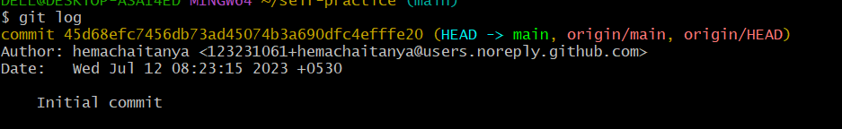
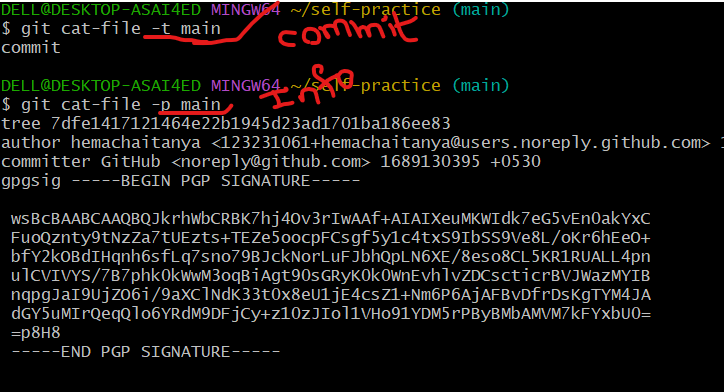

# self-practice
* git does not stores twice it saves only once ( in two folder same data or content it have one commit id)
### hash calculation
 (encrypt some data ,only case the unic number is  equel hash data will be same when code will be same)

### what is branch?

* branch is a reference object which points to same commit id , branch points new commit id 

### tree reprasent folder/directory
### blob reprasents file

